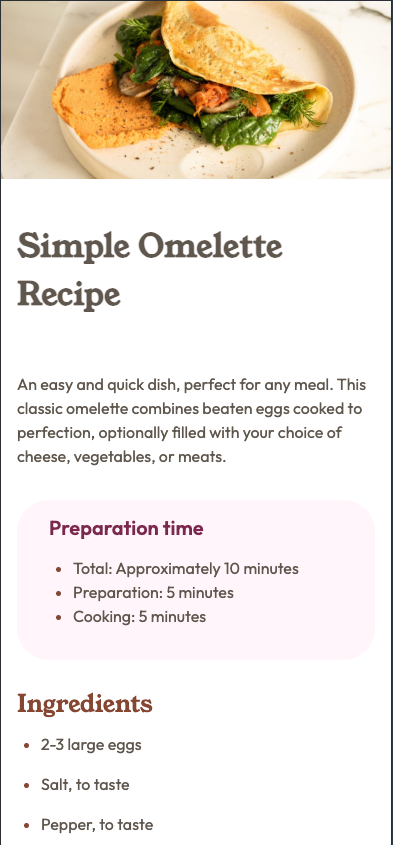

# Frontend Mentor - Recipe page solution

This is a solution to the [Recipe page challenge on Frontend Mentor](https://www.frontendmentor.io/challenges/recipe-page-KiTsR8QQKm). Frontend Mentor challenges help you improve your coding skills by building realistic projects. 

## Table of contents

- [Overview](#overview)
  - [The challenge](#the-challenge)
  - [Screenshot](#screenshot)
  - [Links](#links)
- [My process](#my-process)
  - [Built with](#built-with)
  - [What I learned](#what-i-learned)
  - [Continued development](#continued-development)
- [Author](#author)

## Overview

### Screenshot



### Links

- Solution URL: [Solution URL](https://github.com/hanifmaleki/Recipe-Page)
- Live Site URL: [Live site URL](https://hanifmaleki.github.io/Recipe-Page/)

## My process

### Built with
- Semantic **HTML5** markup  
- **CSS custom properties**  
- **Flexbox**  
- **CSS Grid**  
- **Mobile-first workflow**  
- **Pug** template language  
- **SCSS** (with variables and mixins)  
- **GitHub Actions** (for CI/CD pipeline)  
- **GitHub Pages** (for deployment)  
- **Neovim** (as main editor)  
- **i18 translations**
- [**i18next-parser**](https://www.i18next.com/how-to/extracting-translations)
- **npm scripts** (`copy-js`)  
- [chokidar-cli](https://github.com/open-cli-tools/chokidar-cli)

### What I learned
In this project, I used i18next-parser for the first time to automatically extract translation keys from HTML files and generate JSON translation files.
Here is the configuration file I created for the parser:

```js
module.exports = {
    input: ['dist/**/*.html'],
    output: 'translations/$LOCALE.json',
    locales: ['en', 'de', 'fa'],
    defaultNamespace: 'translation',
    keySeparator: '.',
    namespaceSeparator: ':',
    lexers: {
        pug: ['HTMLLexer'], // ✅ treat Pug like HTML
    },
    defaultValue: (locale, namespace, key) => {
        // auto-generate readable placeholders
        return key.split('.').pop().replace(/[-_]/g, ' ');
    },
}
```

I also introduced a **right-to-left language (Persian)** for the first time.
Fortunately, RTL support worked perfectly for this project.

Additionally, I refactored the **Theme Selector** and **Language Selector** components to make them more modular and reusable.

### Continued Development
In future project, I plan to:
- Improve the language selector with country flags and better visual design.
- Refine the theme selector for a more polished appearance.
- Introduce **Webpack** for better build management and bundling.
- Experiment with a hybrid translation system that handles part of the translation on the server side.

## Author
- Frontend Mentor - [@hanifmaleki](https://www.frontendmentor.io/profile/hanifmaleki)

